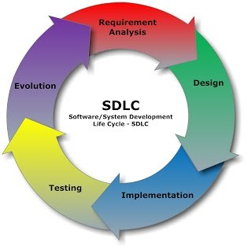

<h1 align="center">BAB II  LANDASAN TEORI</h1>
<strong>2.1	<i>E-Commerce</i></strong> 
<strong>2.1.1	Pengertian <i>E-Commerce</i></strong> 

Menurut Catherine L. Mann (2000), <i>e-commerce</i> bukan sebuah jasa atau sebuah barang, tetapi merupakan perpaduan antara jasa dan barang. <i>E-commerce</i> dan kegiatan yang terkait melalui internet dapat menjadi penggerak untuk memperbaiki ekonomi domestik melalui liberalisasi jasa domestik dan mempercepat integrasi dengan kegiatan produksi global. Karena <i>e-commerce</i> akan mengintegrasikan perdagangan domestik dengan perdagangan dunia, berbagai bentuk pembicaraan atau negosiasi tidak hanya akan terbatas dalam aspek perdagangan dunia, tetapi bagaimana kebijakan domestik tentang pengawasan di sebuah negara, khususnya dalam bidang telekomunikasi, jasa keuangan, dan pengiriman serta distribusi.
      
Dalam mengimplementasikan <i>e-commerce</i> tersedia suatu integrasi rantai nilai dari infrastrukturnya, yang terdiri dari tiga lapis. Pertama, insfrastruktur sistem distribusi <i>(flow of good)</i>; kedua, insfrastruktur pembayaran <i>(flow of money)</i>; dan ketiga, infrastruktur sistem informasi <i>(flow of information)</i>. Agar dapat terintegrasinya sistem rantai suplai dari supplier, ke pabrik, ke gudang, distribusi, jasa transportasi, hingga ke pelanggan maka diperlukan integrasi <i>enterprise system</i> untuk menciptakan <i>supply chain visibility</i>. Ada tiga faktor yang patut dicermati oleh kita jika ingin membangun toko <i>e-commerce</i> yaitu: <i>variability, visibility,</i> dan <i>velocity</i> (Majalah Teknologi, 2001).
 
<i>E-commerce</i> merupakan konsep baru yang biasanya digambarkan sebagai proses jual beli barang atau jasa pada <i>World Wide Web</i> Internet (Shim, Qureshi, Siegel, Siegel, 2000 dalam buku M. Suyanto, 11, 2003) atau proses jual beli atau pertukaran produk, jasa dan informasi melalui jaringan informasi termasuk internet (Turban, Lee, King, Chung, 2000 dalam buku M. Suyanto,11,2003).
 

<strong>2.1.2	Jenis <i>E-Commerce</i></strong> 
<i>E-commerce</i> dapat dikelompokkan berdasarkan aspek. Berikut ini jenis <i>e-commerce</i> berdasarkan sifat transaksinya yaitu (Turban, E., dan King, D., 2002):
 
1.	<i>Business to Business</i> (B2B)
 
Proses transaksi <i>e-commerce</i> bertipe B2B melibatkan perusahaan atau organisasi yang dapat bertindak sebagai pembeli atau penjual.
 
2.	<i>Business to Consumer</i> (B2C)
 
Pada <i>e-commerce</i> bertipe B2C transaksi terjadi dalam skala kecil sehingga tidak hanya organisasi tetapi juga individu dapat terlibat pada pelaksanaan transaksi tersebut. Tipe <i>e-commerce</i> ini biasa disebut dengan e-tailing.
 
3.	<i>Business to Business to Consumer</i> (B2B2C)
 
Pada <i>e-commerce</i> tipe ini, sebuah perusahaan menyediakan produk atau jasa kepada sebuah perusahaan lainnya. Perusahaan lain tersebut kemudian menyediakan produk atau jasa kepada individu yang bertindak sebagai konsumen.
 
4.	<i>Consumer to Consumer</i> (C2C)
 
Pada <i>e-commerce</i> tipe ini, konsumen menjual produk atau jasa yang dimilikinya secara langsung kepada konsumen lainnya.
 
5.	<i>Mobile Commerce (M-Commerce)</i>
 
<i>Mobile commerce</i> merupakan salah satu tipe <i>e-commerce</i> dimana transaksi jual beli dan aktivitas bisnis yang terjadi dilakukan melalui media jaringan tanpa kabel.
 
6.	<i>Intrabusiness E-commerce</i>
 
Aktivitas bisnis yang termasuk ke dalam <i>intrabusiness e-commerce</i> diantaranya proses pertukaran barang, jasa, atau informasi antar unit dan individu yang terdapt pada suatu organisasi atau perusahaan.
 
7.	<i>Business to Employees (B2E)</i>
 
B2E merupakan subset dari kategori <i>intrabusiness e-commerce</i> dimana perusahaan menyediakan pelayanan, informasi, atau produk pada individu pegawainya.
 
8.	<i>Collaborative Commerce</i>
 
Saat individu atau grup melakukan komunikasi atau berkolaborasi secara online, maka dapat dikatakan bahwa mereka terlibat dalam <i>collaborative commerce</i>.
 
9.	<i>Non Business E-Commerce</i>
 
<i>Non business e-commerce</i> merupakan <i>e-commerce</i> yang dilakukan pada organisasi yang tidak berorientasi untuk mendapatkan keuntungan seperti institusi akademis, organisasi keagaamaan, organisasi sosial dsb.
 
10.	<i>E-Government</i>
 
<i>E-government</i> merupakan <i>e-commerce</i> yang dilakukan oleh pemerintah.
 
<strong>2.1.3	Kelebihan <i>E-Commerce</i></strong> 
Menurut E. Turban, David K, J. Lee, T. Liang, D. Turban (2010:67) kelebihan <i>e-commerce</i> dibagi menjadi 3 yaitu:
 
1.	Kelebihan <i>e-commerce</i> bagi perusahaan
 
a.	Ketersediaan pasar nasional dan internasional.
 
b.	Penurunan biaya pemrosesan, distribusi dan penarikan informasi.
 
2.	Kelebihan <i>e-commerce</i> bagi pelanggan
 
a.	Akses ke sejumlah besar produk dan jasa 24 jam sehari.
 
3.	Kelebihan <i>e-commerce</i> bagi masyarakat
 
a.	Dengan mudah dan nyaman memberikan layanan informasi, serta berbagai produk ke orang-orang dikota, didesa, dan berbagai Negara berkembang,
 
<strong>2.1.4	Kekurangan <i>E-Commerce</i></strong> 
Menurut E. Turban, David K, J. Lee, T. Liang, D. Turban (2010:68), <i>e-commerce</i> memiliki beberapa keterbatasan, secara teknologi dan non teknologi, yang telah memperlambat pertumbuhan dan penerimaannya. Keterbatasan teknologi meliputi kurangnya standar keamanan yang diterima secara universal, bandwidth telekomunikasi yang tidak cukup dan mahalnya akses. Keterbatasan non teknologi meliputi persepsi bahwa <i>e-commerce</i> tidak aman, segi hukumnya yang belum lengkap, serta kurangnya penjualan dan pembeli besar yang penting.
 
<strong>2.2	Aplikasi Web</strong>
Menurut Pressman, Roger S. (2010:8) Aplikasi web yang disebut <i>“webapps”</i> adalah kategori perangkat lunak jaringan-setris yang mencakup beragam aplikasi. Dalam bentuknya yang paling sederhana, <i>webapps</i> dapat menjadi <i>link hypertext informative</i> yang menggunakan teks dan grafis yang terbaatas. Namun, dengan munculnya Web 2.0, <i>webapps</i> berkembang menjadi lingkungan komputerisasi canggih yang tidak hanya menyediakan fitur <i>stand-alone</i> (berdiri sendiri), fungsi komputasi, dan konten kepada pengguna akhir, tetapi juga terintegrasi dengan database perusahaan dan aplikasi bisnis.
 
<strong>2.2.1	HTML <( Hyper Text Markup Language)</strong> 
Menurut Shelly, Woods, Dorin (2010:8), Halaman web dibuat menggunakan <i>Hyper Text Markup Language (HTML)</i>, yang merupakan bahasa authoring yang digunakan untuk membuat dokumen <i>World Wide Web</i> (www). <i>HTML</i> menggunakan set instruksi khusus yang disebut tag atau markup untuk menentukan struktur dan tata letak dokumen web, dan menetukan bagaimana halaman ditampilkan di browser.
 
<strong>2.2.2	XAMPP</strong> 
Menurut Nugroho, B (2008:2) XAMPP adalah suatu bundel <i>web server</i> yang popular digunakan untuk coba-coba di Windows karena kemudahan instalasinya. Bundel program <i>open source</i> tersebut berisi antara lain <i>server web, Apache, interpreter PHP,</i> dan basis data <i>MySQL</i>.
 
<strong>2.2.3	<i>PHP (Hypertext Preprocessor)</i></strong> 
Menurut P. Maclntyre, B. Danchilla, M. Gogala (2011:18) <i>PHP</i> adalah Bahasa pengembangan web yang paling populer di pasar saat ini. <i>PHP</i> hanyalah sebuah generator markup <i>HTML</i>. Jika Anda melihat <i>source code</i> dari <i>PHP</i> pada halaman web, Anda hanya akan melihat tag <i>HTML</i>, mungkin beberapa <i>JavaScript</i> juga tapi tidak ada kode <i>PHP</i> mentah.
 
<strong>2.2.4	<i>Framework</i></strong> 
Menurut Septian (2011:7) <i>Framework</i> sebagaimana arti dalam Bahasa Indonesia yaitu kerangka kerja dapat diartikan sebagai kumpulan dari <i>library (class)</i> yang dapat diturunkan, atau dapat langsung dipakai fungsinya oleh modul-modul atau fungsi yang akan kita kembangkan.
 
<strong>2.2.5	<i>CodeIgniter</i></strong> 
Menurut Septian (2011:9) <i>CodeIgniter</i> adalah aplikasi <i>open source</i> yang berupa <i>framework</i> dengan model <i>MVC (Model, View, Controller)</i> untuk membangun website dinamis. Dengan menggunakan <i>PHP code igniter</i> akan memudahkan <i>developer</i> untuk membuat aplikasi web dengan cepat dan mudah dibandingkan dengan membuat dari awal.
 
<strong>2.2.6	<i>Bootstrap</i></strong> 
Berdasarkan kutipan Husein Alatas (2013:2) <i>Bootstrap</i> merupakan <i>framework</i> maupun <i>tools</i> untuk memudahkan aplikasi web ataupun situs <i>web responsive</i> secara cepat, mudah dan gratis. <i>Bootstrap</i> sendiri terdiri dari <i>CSS</i> dan <i>HTML</i> untuk menghasilkan <i>grid, layout, typography, table, form, navigation</i> dan lain-lain. Didalam <i>bootstrap</i> juga sudah terdapat <i>jquery plugin</i> untuk menghasilkan komponen UI yang cantik seperti <i>transitions, modal, dropdown, scrollspy, tooltip, tab, popover, alert, button, carousel</i> dan lain-lain.
 
<strong>2.2.7	<i>Database</i></strong> 
Menurut Connolly, Thomas M., Begg, Carolyn E (2010:7) <i>Database</i> adalah sekumpulan data yang terhubung secara <i>logical</i> (deskripsi dari data tersebut) yang dirancang untuk memenuhi kebutuhan informasi dari sebuah organisasi.
 
<strong>2.2.8	<i>MySQL</i></strong> 
Menurut Welling (2001:3) <i>MySQL</i> adalah <i>relational database management system</i> yang cepat dan kuat. Sebuah basis data dapat membuat pengguna untuk menyimpan, mencari, mengurutkan dan mendapatkan data dengan mudah. <i>Server MySQL</i> mengendalikan akses ke dalam data untuk memastikan bahwa para pengguna dapat bekerja dalam waktu yang bersamaan, untuk mendukung akses secara cepat dan memastikan hanya pengguna yang telah terisolasilah yang mendapatkan hak akses. <i>MySQL</i> menggunakan Bahasa <i>SQL (Structured Query Language)</i>, yaitu Bahasa <i>query</i> basis data yang baku bagi seluruh dunia. <i>MySQL</i> kembali di duplikasi sejak tahun 1996, tetapi dengan lisensi <i>open source</i>, tetapi lisensi komersial pun tersedia apabila diperlukan.
 

<strong>2.2.9	<i>Unified Modeling Language (UML)</i></strong> 
<strong>2.2.9.1	Pengertian <i>Unified Modeling Language (UML)</i></strong> 
Menurut Nugroho (2009:4), <i>UML (Unified Modeling Language)</i> adalah Metodologi kolaborasi antara metoda-metoda Booch, <i>OMT (Object Modeling Technique)</i>, serta <i>OOSE (Object Oriented Software Enggineering)</i> dan beberapa metoda lainnya, merupakan metodologi yang paling sering digunakan saat ini untuk analisa dan perancangan sistem dengan metodologi berorientasi objek mengadaptasi maraknya penggunaan bahasa “pemrograman berorientasi objek” (OOP). 
 
<strong>2.2.9.2	Langkah-Langkah Penggunaan <i>Unified Modeling Language (UML)</i></strong> 
Menurut Henderi (2008:6), langkah-langkah penggunaan <i>Unified Modeling Language (UML)</i> sebagai berikut:
 
1.	Buatlah daftar <i>business process</i> dari level tertinggi untuk mendefinisikan aktivitas dan proses yang mungkin muncul.
 
2.	Petakan <i>use case</i> untuk setiap <i>business process</i> untuk mendefinisikan dengan tepat fungsional yang harus disediakan oleh sistem, kemudian perhalus <i>use case diagram</i> dan lengkapi dengan <i>requirement, constraints</i> dan catatan-catatan lain.
 
3.	Buatlah <i>deployment diagram</i> secara kasar untuk mendefinisikan arsitektur fisik sistem.
 
4.	Definisikan <i>requirement</i> lain non fungsional, <i>security</i> dan sebagainya yang juga harus disediakan oleh sistem.
 
5.	Berdasarkan <i>use case diagram</i>, mulailah membuat <i>activity diagram</i>.
 
6.	Definisikan obyek - obyek level atas <i>package</i> atau domain dan buatlah <i>sequence</i> dan <i>collaboration</i> untuk tiap alur pekerjaan, jika sebuah <i>use case</i> memiliki kemungkinan alur normal dan error, buat lagi satu diagram untuk masing-masing alur.
 
7.	Buatlah rancangan <i>user interface model</i> yang menyediakan antar muka bagi pengguna untuk menjalankan skenario <i>use case</i>.
 
8.	Berdasarkan model-model yang sudah ada, buatlah <i>class diagram</i>. Setiap <i>package</i> atau domian dipecah menjadi hirarki <i>class</i> lengkap dengan Atribut dan metodenya. Akan lebih baik jika untuk setiap <i>class</i> dibuat unit test untuk menguji fungsionalitas <i>class</i> dan interaksi dengan <i>class</i> lain.
 
9.	Setelah class diagram dibuat, kita dapat melihat kemungkinan pengelompokkan class menjadi komponen-komponen karena itu buatlah component diagram pada tahap ini. Juga, definisikan test integrasi untuk setiap komponen meyakinkan ia bereaksi dengan baik.
 
10.	Perhalus deployment diagram yang sudah dibuat. Detilkan kemampuan dan requirement piranti lunak, sistem operasi, jaringan dan sebagainya. Petakan komponen ke dalam node.
 
11.	Mulailah membangun sistem. Ada dua pendekatan yang tepat digunakan:
 
a.	Pendekatan <i>use case</i> dengan mengassign setiap <i>use case</i> kepada tim pengembang tertentu untuk mengembangkan unit kode yang lengkap dengan test.
 
b.	Pendekatan komponen yaitu mengassign setiap komponen kepada tim pengembang tertentu.
 
<strong>2.2.9.3	<i>Model Unified Modeling Language (UML)</i></strong> 
Menurut Widodo (2011:10), “Beberapa literature menyebutkan bahwa <i>UML</i> menyediakan sembilan jenis diagram, yang lain menyebutkan delapan karena ada beberapa diagram yang digabung, misanya diagram komunikasi, diagram urutan dan diagram pewaktuan digabung menjadi diagram interaksi”. Namun demikian model-model itu dapat dikelompokkan berdasarkan sifatnya yaitu statis atau dinamis. Jenis diagram itu antara lain:
 
1.	Diagram kelas <i>(Class Diagram)</i>
 
Bersifat statis, Diagram ini memperlihatkan himpunan kelas-kelas, antarmuka-antarmuka, kolaborasi-kolaborasi, serta relasi-relasi. Diagram ini umum dijumpai pada pemodelan sistem berorientasi objek. Meskipun bersifat statis, sering pula diagram kelas memuat kelas-kelas aktif.
 
2.	Diagram paket <i>(Package Diagram)</i>
 
Bersifat statis. Diagram ini memperlihatkan kumpulan kelas-kelas, merupakan bagian dari diagram komponen.
 
3.	Diagram use-case <i>(Usecase Diagram)</i>
 
Bersifat statis. Diagram ini memperlihatkan himpunan use-case dan aktor-aktor (suatu jenis khusus dari kelas). Diagram ini terutama sangat penting untuk mengorganisasi dan memodelkan perilaku suatu sistem yang dibutuhkan serta diharapkan pengguna.
 
4.	Diagram interaksi dan sequence <i>(Sequence Diagram)</i>
 
Bersifat dinamis. Diagram urutan adalah iterasiksi yang menekankan pada pengiriman pesan dalam suatu waktu tertentu.
 
5.	Diagram komunikasi <i>(Communication Diagram)</i>
 
Bersifat dinamis. Diagram sebagai pengganti diagram kolaborasi <i>UML</i> yang menekankan organisasi struktural dari objek-objek yang menerima serta mengirim pesan.
 
6.	Diagram statechart <i>(Statechart Diagram)</i>
 
Bersifat dinamis. Diagram status memperlihatkan keadaan-keadaan pada sistem, memuat status <i>(state)</i>, transisi, kejadian serta aktivitas.
 
7.	Diagram aktivitas <i>(Activity Diagram)</i>
Bersifat dinamis. Diagram aktivitas adalah tipe khusus dari diagram status yang memperlihatkan aliran dari suatu aktivitas ke aktivitas lainnya dalam suatu sistem. Diagram ini terutama penting dalam pemodelan fungsi-fungsi suatu sistem dan memberi tekanan pada aliran kendali antar objek.
 
8.	Diagram komponen <i>(Component Diagram)</i>
Bersifat statis. Diagram komponen ini memperlihatkan organisasi serta kebergantungan sistem/perangkat lunak pada komponen-komponen yang telah ada sebelumnya.
 
9.	Diagram deployment <i>(deployment diagram)</i>
 
Bersifat statis. Diagram inimemperlihatkan konfigurasi saat aplikasi dijalankan (run-time). Memuat simpul-simpul beserta komponen-komponen yang di dalamnya. Kesembilan diagram ini tidak mutlak harus digunakan dalam pengembangan perangkat lunak, semuanya dibuat sesuai kebutuhan.
 
<strong>2.3	Google <i>Map Service</i></strong> 
Google <i>Map Service</i> adalah sebuah jasa peta global virtual gratis dan online yang disediakan oleh perusahaan Google. Google <i>Maps</i> (GM) merupakan sebuah aplikasi online yang cukup popular. Pada Google <i>Maps</i>, titik koordinat suatu tempat ditunjukkan dengan sistem koordinat geografis. Google Maps dapat ditemukan di alamat http://maps.google.com .
 
<strong>2.4	<i>Business Process Modeling Notation</i> (BPMN)</strong> 
Menurut Jeston dan Nelis (2006, p126) <i>Business Process Modeling Notation</i> (BPMN) adalah suatu notasi standar yang dapat berupa ikon atau gambar untuk digunakan di dalam pemodelan proses bisnis.
 
<strong>2.5	Metodologi Penelitian</strong> 
<strong>2.5.1	<i>System Development Life Cycle</i></strong> 
Dalam pengembangan aplikasi <i>e-commerce</i> digunakan metode SDLC <i>(System Development Life Cycle)</i> yang meliputi :
 
1.	Analisa system <i>(system analysis)</i>
 
a. Studi pendahuluan 
 
Merupakan studi yang dilakukan untuk mempertajam arah studi utama. Dengan demikian,studi pendahuluan bisa saja menghasilkan perubahan  prosedur penmelitian, meningkatkan pengukuran, meningkatkan peningkatkan kepercayaan asumsi,dan desain yang lebih mantap. Studi pendahuluan merupakan salah satu aktivitas atau kegiatan persiapan yang dilakukan oleh seorang peneliti, dengan tujuan untuk menentukan objek dan subjek penelitian yang tepat, yang sesuai dengan tema penelitian yang menjadi fokus kajian peneliti.
 
b.	Studi kelayakan.
 
c.	Mengidentifikasi permasalahan dan kebutuhan pemakai.
 
d.	Memahami system yang ada.
 
e.	Menganalisa hasil penelitian.
 
2.	Penrancangan system<i>(system design)</i>
 
a.	Perancangan awal 
 
b.	Perancangan rinci
 
1.	Implementasi system<i>(system implementation)</i>
 
2.	Operasi dan perawatan system <i>(system operation and maintenance)</i>
 
Sistem atau daur hidup pengembangan system tampak jika system yang sudah dikembangkan dan dioperasikan tidak dapat dirawat lagi, sehingga dibutuhkan pengembangan system kembali yang tampak digambarkan seperti gambar berikut :
 
 

 
 

Gambar 2.1 Siklus hidup pengembangan sistem
 
<strong>2.6	Jurnal Penelitian</strong> 
Tabel 2.1 Jurnal Penelitian
 
No.	Nama Jurnal	Peneliti	Judul Penelitian	Kesimpulan
 
1.	Jurnal e-commerce menggunakan metode prototyping	Izharyan Iqbal, R. Wahyu Witjaksono dan M. Teguh Kurniawan	Perancangan Aplikasi penjualan berbasis web dengan metode prototyping pada cv. khatulistiwa	Dapat mengakomodasi aktivitas jual-beli dan pelayanan yang dilakukan dengan lebih cepat dan efisien
 
2.	Jurnal e-commerce dalam menunjang penjualan produk	Jajat Sudrajat	Penerapan e-commerce dalam menunjang penjualan produk	Dapat membantu penjual untuk mempromosikan penjualannya secara online
 
3.	Jurnal pemanfaatan e-commerce	Dewi Irmawati	Pemanfaatan e-commerce dalam dunia bisnis	Dapat memberikan manfaat yang besar terhadap dunia bisnis yang kompetitif
 
4.	Jurnal <i>e-commerce</i> untuk usaha kecil dan menengah	Dewi Shanti Nugrahani	<i>E-commerce</i> untuk pemasaran produk usaha kecil dan menengah	Dapat menguntungkan konsumen dengan memperoleh produk yang lebih murah
 
5.	Jurnal <i>e-commerce</i> dengan sistem informasi transaksi berbasis sms gateway	Aris Setiyadi dan Ramadhian Agus Triyono	Pembangunan <i>e-commerce</i> dengan sistem informasi transaksi berbasis sms gateway pada toko aska	Dapat memudahkan pengelola dan konsumen untuk mendapatkan informasi transaksi melalui media sms
 

